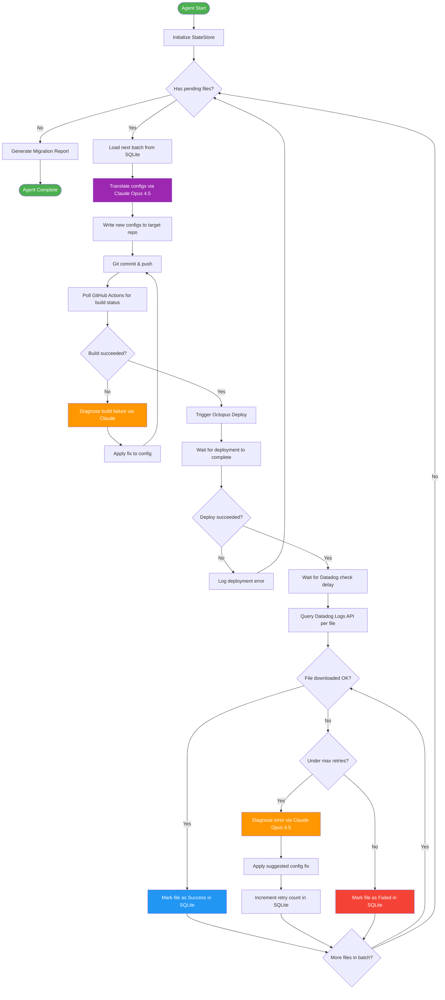
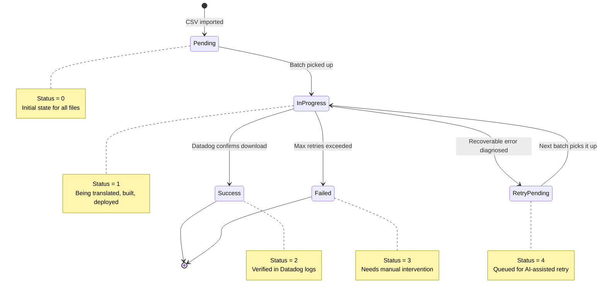
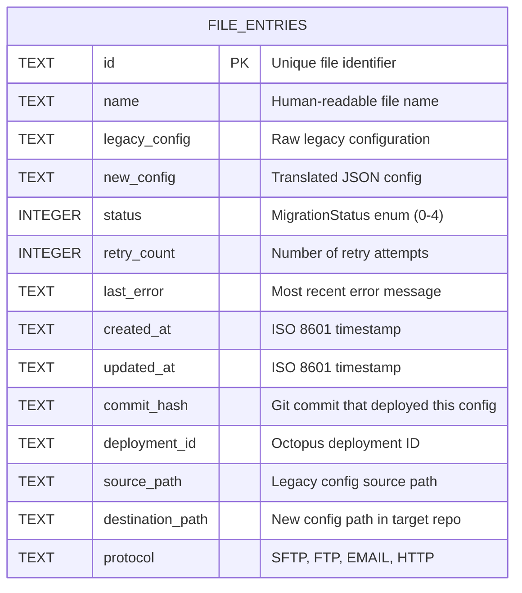
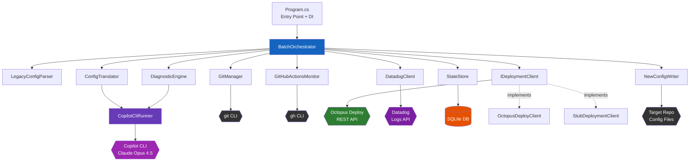
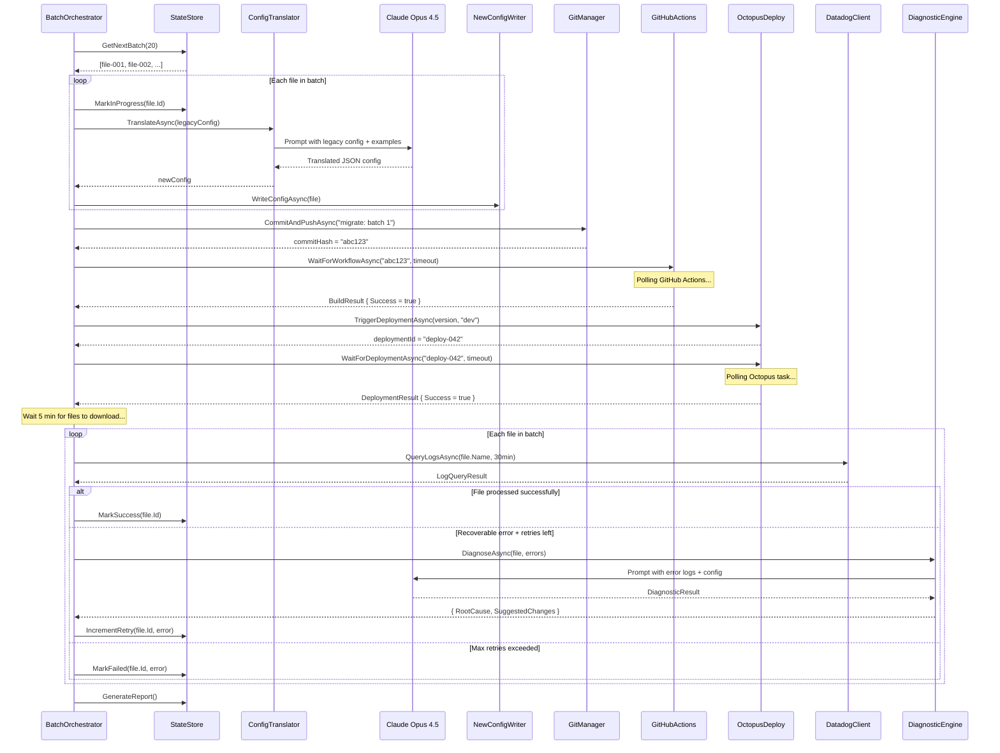
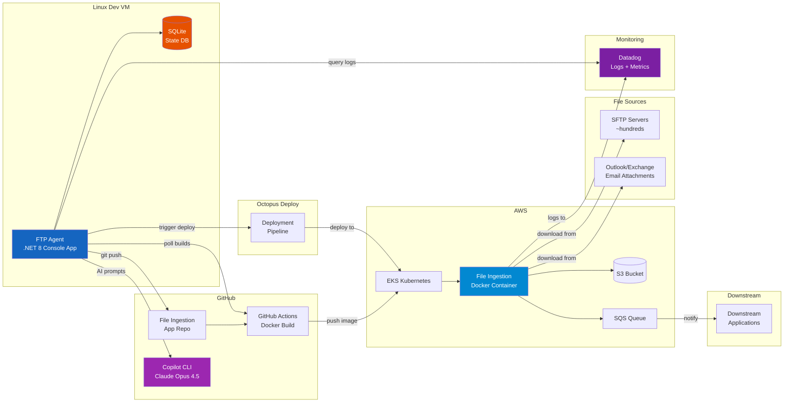
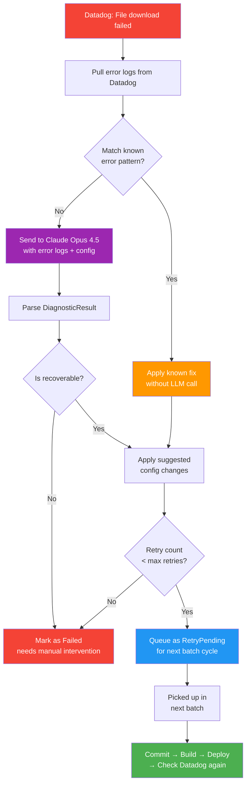
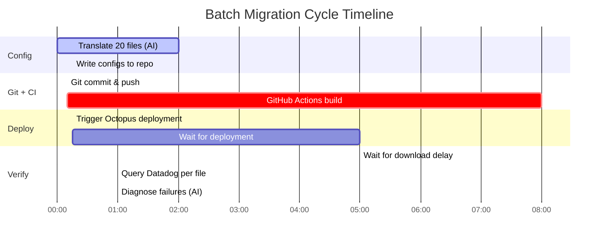
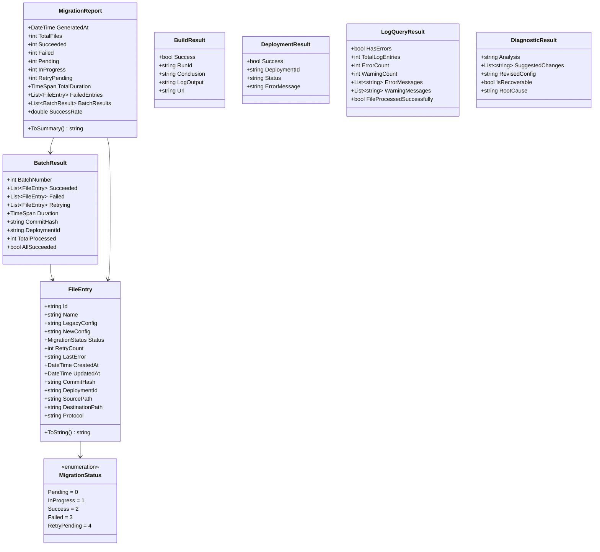

# Diagrams

Visual aids for the FTP Agent architecture. All diagrams use [Mermaid](https://mermaid.js.org/) syntax and render natively on GitHub.

---

## 1. Autonomous Migration Loop (Flowchart)

The core feedback loop the agent executes for each batch of files.

---

## 2. File Migration State Machine

Lifecycle of a single file entry through the migration pipeline.

---

## 3. Database Schema (SQLite)

The `file_entries` table in the SQLite state store.

---

## 4. Component Dependency Graph

How the C# classes depend on each other via dependency injection.

---

## 5. Sequence Diagram: Single Batch Migration

End-to-end flow for one batch of files.

---

## 6. Infrastructure Overview

How the agent fits into the broader system architecture.

---

## 7. Config Translation Data Flow

How a legacy config becomes a deployed new config.

```mermaid
flowchart LR
    CSV[legacy-file-list.csv<br/>~1400 rows] -->|LegacyConfigParser| Parsed[Parsed FileEntry<br/>objects]
    Parsed -->|ConfigTranslator| Prompt[Prompt Template<br/>+ Legacy Config]
    Prompt -->|Copilot CLI| Claude[Claude Opus 4.5]
    Claude --> JSON[Translated JSON<br/>Config]
    JSON -->|NewConfigWriter| Repo[Target Repo<br/>configs/sftp/file.json]
    Repo -->|git push| GHA[GitHub Actions<br/>Docker Build]
    GHA --> Image[Docker Image<br/>with new configs]
    Image -->|Octopus Deploy| EKS[EKS Pod<br/>picks up config]
    EKS -->|Downloads file| S3[File in S3]

    style CSV fill:#FFB300,color:#000
    style Claude fill:#9C27B0,color:#fff
    style S3 fill:#4CAF50,color:#fff
```

---

## 8. Retry & Diagnosis Flow

What happens when a file fails and the agent diagnoses the issue.

---

## 9. Batch Processing Timeline

Typical timeline for a single batch cycle.

---

## 10. Class Diagram: Core Models

The data models used throughout the pipeline.

